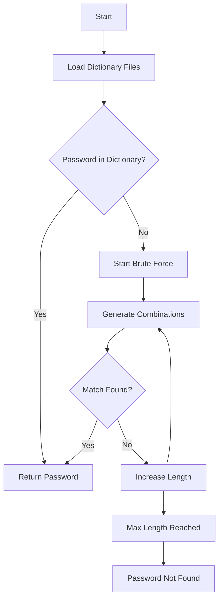

# 🔐 Educational Password Brute-Force Demonstration


> ⚠️ **DISCLAIMER**  
> This project is strictly for **educational and ethical cybersecurity learning purposes**.  
> Do **NOT** use this code to attack accounts, systems, or passwords that you do not own or have explicit permission to test.

---

## 📌 Description

This project demonstrates a **basic password brute-force and dictionary attack approach** using Python.  
It shows how weak passwords can be discovered through:

- Common password lists
- Name dictionaries
- Brute-force character combinations

The goal is to help learners understand:
- Why strong passwords matter
- How brute-force attacks work internally
- The limitations and time cost of naive brute-force techniques

---

## 📚 Table of Contents

- [Features](#-features)
- [How It Works](#-how-it-works)
- [Project Structure](#-project-structure)
- [Requirements](#-requirements)
- [Usage](#-usage)
- [Example Output](#-example-output)
- [Important Notes](#-important-notes)
- [Legal & Ethical Warning](#-legal--ethical-warning)
- [License](#-license)

---

## ✨ Features

- ✅ Dictionary attack using common passwords
- ✅ Name-based password detection
- ✅ Case-insensitive matching
- ✅ Brute-force attack with configurable length
- ✅ Execution time measurement
- ✅ Simple, readable Python implementation

---

## 🧠 How It Works

<details>
<summary><strong>1️⃣ Dictionary Check</strong></summary>

- Loads common passwords from a file
- Loads common names from a file
- Compares the target password directly and case-insensitively

</details>

<details>
<summary><strong>2️⃣ Brute-Force Attack</strong></summary>

- Uses lowercase letters (`a-z`) and digits (`0-9`)
- Generates all possible combinations up to a specified length
- Stops immediately when the password is found

</details>

<details>
<summary><strong>3️⃣ Performance Tracking</strong></summary>

- Measures total execution time
- Shows how quickly simple passwords can be broken

</details>

---

## 📁 Project Structure

```text
.
├── main.py
├── Top12Thousand-probable-v2.txt
├── middle-names.txt
└── README.md
```

---

> 📌 **Note:** Dictionary files must exist at `/content/` or be updated to match your local path.

---

## ⚙️ Requirements

* Python **3.x**
* Required libraries:

  * `numpy`

Install dependencies:

```bash
pip install numpy
```

---

## ▶️ Usage

Example usage inside the script:

```python
result = bruteforce("ab1", max_nchar=3)
print("Returned value:", result)
```

### Parameters

| Parameter   | Description                             |
| ----------- | --------------------------------------- |
| `password`  | Password to test (must be your own)     |
| `max_nchar` | Maximum length for brute-force attempts |

---

## 🧪 Example Output

```text
1) Comparing with most common passwords / first names
Not found in dictionaries.
2) Starting brute-force search...
Trying passwords of length 1...
Trying passwords of length 2...
Trying passwords of length 3...

Password found: ab1
Time taken: 0.03 seconds
Returned value: ab1
```

---

## ⚠️ Important Notes

* 🔓 This method is **extremely slow** for longer or complex passwords
* 🔐 Real systems use:

  * Hashing
  * Salting
  * Rate limiting
  * Account lockouts
* 🚫 This code **does not bypass real security systems**

---

## 🚨 Legal & Ethical Warning

> **Unauthorized password cracking is illegal and unethical.**

You must:

* Own the account/system **OR**
* Have **explicit written permission**

This repository is intended for:

* Cybersecurity education
* Defensive security research
* Demonstrations and learning

---

## 📄 License

This project is licensed under the **MIT License**.
You are free to use, modify, and distribute it **for ethical purposes only**.

---


## 🔄 Flow Diagram

### 🧩 High-Level Execution Flow

```text
┌───────────────┐
│ Start Program │
└───────┬───────┘
        │
        ▼
┌──────────────────────────┐
│ Load Common Passwords &  │
│ Name Dictionaries        │
└─────────┬────────────────┘
          │
          ▼
┌──────────────────────────┐
│ Password in Dictionaries│
│  or Names?               │
└───────┬───────────┬──────┘
        │Yes        │No
        ▼           ▼
┌───────────────┐   ┌──────────────────────────┐
│ Password Found│   │ Begin Brute-Force Attack │
│ (Exit)        │   └─────────┬────────────────┘
└───────────────┘             │
                              ▼
                ┌──────────────────────────────┐
                │ Generate Character Combinations│
                │ (Length 1 → max_nchar)        │
                └─────────┬────────────────────┘
                          │
                          ▼
                ┌──────────────────────────────┐
                │ Compare Each Combination     │
                │ with Target Password         │
                └─────────┬───────────────┬────┘
                          │Match Found?   │No
                          ▼               ▼
                ┌───────────────┐   ┌───────────────┐
                │ Password Found│   │ Continue Loop │
                │ (Exit)        │   └───────┬───────┘
                └───────────────┘           │
                                            ▼
                                   ┌────────────────┐
                                   │ Password Not   │
                                   │ Found (Exit)   │
                                   └────────────────┘
```

---

### 📊 Mermaid Flow Diagram (GitHub-supported)




---

## 📐 Complexity Analysis

### 🧠 Definitions

Let:

* `N` = number of entries in dictionary files
* `k` = size of character set
  (`26 letters + 10 digits = 36`)
* `L` = maximum password length (`max_nchar`)

---

### ⏱ Time Complexity

#### 1️⃣ Dictionary Attack Phase

* Direct lookup and iteration over dictionaries

**Time Complexity:**

```
O(N)
```

> Efficient for weak/common passwords, very fast in practice.

---

#### 2️⃣ Brute-Force Phase

The brute-force algorithm generates **all possible combinations** of characters up to length `L`.

Total combinations tested:

[
\sum_{i=1}^{L} k^i = k^1 + k^2 + \dots + k^L
]

Which simplifies to:

```
O(k^L)
```

For this implementation:

* `k = 36`
* Example:

  * L = 3 → ~46,656 attempts
  * L = 5 → ~60 million attempts

⛔ **Exponential growth makes brute-force infeasible for large `L`.**

---

### 💾 Space Complexity

* Dictionaries loaded into memory
* One password combination held at a time

**Space Complexity:**

```
O(N)
```

> Brute-force itself is memory-efficient but CPU-expensive.

---

## 🔐 Security Implications

* ✔ Short passwords are extremely vulnerable
* ❌ Increasing length exponentially increases attack cost
* 🔒 Modern systems mitigate brute-force using:

  * Hashing + salting
  * Rate limiting
  * CAPTCHA
  * Account lockouts

---

## 🧪 Educational Takeaway

> **Brute-force attacks are not clever — they are powerful only against weak passwords.**

This project demonstrates:

* Why **password length matters more than complexity**
* Why **dictionary attacks succeed first**
* Why real-world systems **never store plaintext passwords**

---

### ⭐ If you find this helpful, consider starring the repository!


---
